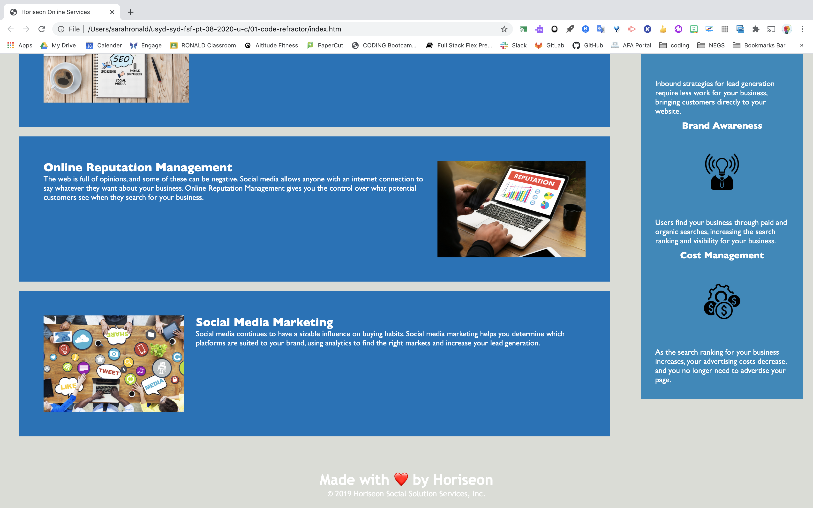

# 01-code-refractor
# HOMEWORK ASSIGNMENT 1

## Contents

The app is composed of 2 pages, index.html and style.css. It also has images in the img folder.

## User Story

As a marketing agency the consumer wants a codebase that follows accessibility standards so that our own site is optimized for search engines.

## Acceptance criteria

* GIVEN a webpage meets accessibility standards
* WHEN I view the source code
* THEN I find the semantic HTML elements
* WHEN I view the structure of the HTML elements
* THEN I find that the elements follow a logical structure independent of styling and positioning
* WHEN I view the image elements
* THEN I find accessible alt attributes
* WHEN I view the heading attributes
* THEN they fall in the sequential order
* WHEN I view the title element
* THEN I find a concise, descriptive title

## Built With

* [VScode](https://code.visualstudio.com/) - The editor of choice
* [Terminal](https:///) - What would we do without our bash?

#### Initial interface

Format: 

Format: 

### Licence

Due to the nature of the exercise, no license has been included.

### Link to the App
<a href="file:///Users/sarahronald/usyd-syd-fsf-pt-08-2020-u-c/01-code-refractor/index.html">Link to the App</a>

## Authors
* **SARAH RONALD** - 
Contact information:
sareronald@hotmail.com
